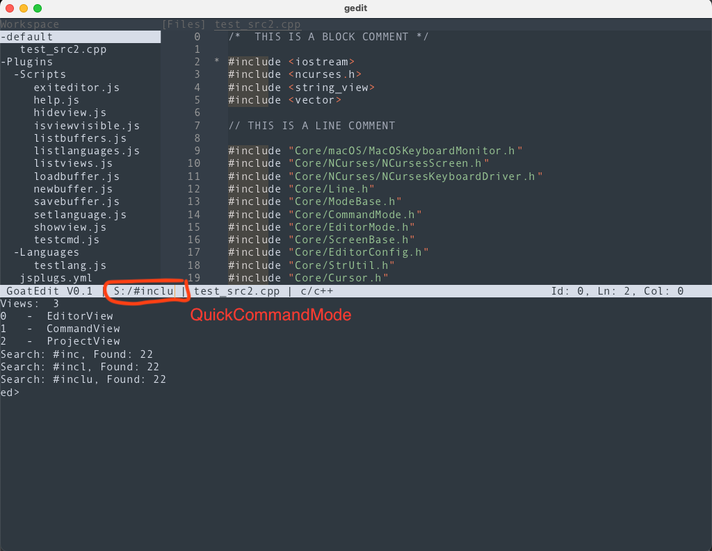

# Editor Project

[](https://github.com/gnilk/editor/actions/workflows/cmake.yml)

Someone (Peter Norton?) once said that in order to really become a programmer one has to write
an editor. 

This is my playground....


Currently running on Linux (NCurses and SDL2) and macOS (NCurses and SDL2/SDL3).

Goals
- Mimic Amiga AsmOne with a dedicated cmd-line mode (like a shell) for editor commands
- Pass through to underlying shell in case the command is not an editor command
- Support for different backends
  - NCurses (terminal)
  - SDL3 for a proper (i.e. a real application) frontend
  - etc...

Pressing ESC enters command mode, which is an embedded terminal (bash/sh/zsh or whatever you fancy)


The idea with the shell/command is similar to a game-console or if you want 
a multi-line VI/VIM command mode. Allows us to execute editor functionality through a command-line interface.
If the given command is not an editor command it is sent to the terminal. In order to avoid actual terminal commands
being blocked by editor commands or vice-verse a special prefix (configurable) must be present before any editor command.

Noteworthy:
A terminal application can't properly trap SHIFT + <certain keys> (at least not through ncurses).
Therefore, the terminal backend (NCurses for now) will spawn a special thread very similar
to a keylogger. You will have to allow the terminal "Input Monitoring" capabilities in 
the macOS settings IF you want SHIFT+Arrow keys to work properly.

The code for this "keylogger" is also part of the repository.

Got a quite simple but nice stack-based language tokenizer running. Use it to drive syntax highlighting.

## SDL2/3 Backend

Took a stab at testing if multiple backends where actually possible. Decided to try libSDL - haven't used it before.
Worked fine, using stb_ttf for true type fond rendering.

Keyboard handling is solved listening to the SDL_TEXT_INPUT event, not quite sure if this will works. Seems like SDL
has the ability to buffer things (I dont) - but haven't seen it yet.

The quickcommand mode is a faster way to access certain features than going via the command/terminal view. It allows
for a 'vi/vim' - like interface. It can also execute plugins (save/load/etc..) besides doing search and so forth. The
output from quickcommand's are always the terminal. As you can see in the screenshot the search results are written 
to the terminal.


# Building
The build is driven by CMake.

Cmake will check if 'ext/' contains the dependencies (which are considered local) and check them out if they don't
exists. Other dependencies are considered system dependencies and you need to install them.

If it doesn't build out of box, check that stuff is installed properly and that CMakeLists.txt points to the dependencies
in the proper way. You are looking for a bunch of:
```
    set(YAML_CPP_HOME /usr)
    set(NCURSES_HOME /usr)
    set(SDL_HOME /usr/local)
    set(DUKTAPE_HOME ext/duktape-2.7.0/src)
    set(DUKTAPE_EXTRAS ext/duktape-2.7.0/extras)
    set(DUKGLUE_HOME ext/dukglue) 
    set(FMT_HOME ext/fmt)   
```

## Dependencies
- yaml-cpp, https://github.com/jbeder/yaml-cpp
- ncurses, on *nix it is generally available, otherwise: https://invisible-island.net/ncurses/announce.html
- nlohmann/json, https://github.com/nlohmann/json
- libSDL, https://github.com/libsdl-org/SDL currently using master branch (SDL3)
- duktape 2.7.0, https://github.com/svaarala/duktape - clone this to editor/ext/duktape-2.7.0
- dukglue (just take master), https://github.com/Aloshi/dukglue - clone this to editor/ext/dukglue
- logger, https://github.com/gnilk/logger - clone this to editor/ext/logger
- stb, https://github.com/nothings/stb, ttf and rect_pack (already added to my repo)
- fmtlib, https://github.com/fmtlib/fmt, CPP string formatting with U32/U16/U8 support


- libSDL, ncurses, yaml, nlohmann you can download and install the packages. 
- duktape, dukglue, logger you should clone and link - see CMakeLists.txt

# Plugins
Playing around with embedding a script language to drive command-mode cmd-let's. At the end I settled for JavaScript.

## JavaSript
Using duktape for javascript. Tried out QuickJS but had better luck with Duktape.
Played around with DukTape and QuickJS.

Plugins are used to implement (mainly as a test) some administrative commands for the moment.
I plan to extend the API so you can do more but right now there isn't much...

